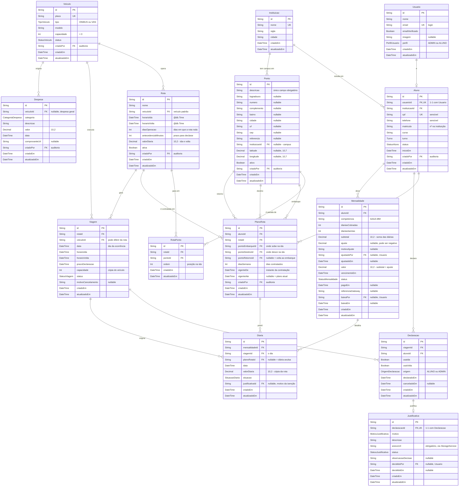

# Modelagem de dados (diagrama ER)

Entrega do cartão [[BANCO] Diagrama ER](https://trello.com/c/K3mpOi99/8-banco-diagrama-er).
Este documento é a fonte do `prisma/schema.prisma` — ao mudar o schema, mude aqui junto.

## Como a cobrança funciona

Tudo no modelo gira em torno disto, então vale escrever antes do diagrama:

1. O aluno contrata um **plano**: quais dias da semana ele usa o transporte em uma rota.
   Esse plano pode mudar a qualquer momento.
2. Cada dia previsto pelo plano gera uma **diária**, cobrada pela tarifa da rota — rota
   curta custa menos que rota longa. **Uma diária cobre o dia inteiro**: ida e volta.
3. A diária é cobrada mesmo se o aluno não for. **Só deixa de ser cobrada** quando ele
   justifica a falta com anexo (atestado, aula cancelada) e o admin aprova, ou quando a
   viagem inteira é cancelada.
4. O aluno também pode apenas **avisar que não vai**, sem justificar. Isso **não**
   desconta nada: serve para a operação saber quantos veículos mandar e se pode passar
   reto em um ponto onde ninguém embarca nem desce.
5. Em um dia que ele **não** contratou, ele pode avisar que vai — e aí paga uma diária
   avulsa por aquele dia.
6. A **mensalidade** é a soma das diárias de um mês, com espaço para ajuste manual.

O ponto 4 é o que inverte a lógica do sistema: em dia contratado, o padrão é que o aluno
vai — quem não declara nada está previsto na viagem. O que ele registra é a **ausência**.
Em dia não contratado, o padrão se inverte: ninguém vai, e a declaração é o que o inclui.

## Convenções

- **Identificadores:** `id String @id @default(cuid())` em todas as tabelas. Sem chave
  composta, para simplificar as FKs; a unicidade de negócio vira `@@unique`.
- **Datas:** `DateTime` em UTC. A conversão para o fuso do usuário é responsabilidade
  da camada de apresentação.
- **Dinheiro:** `Decimal @db.Decimal(10, 2)`. Nunca `Float` — ponto flutuante não fecha
  soma de centavos, e tanto a mensalidade quanto a página de transparência somam valores.
- **Dias da semana:** `Int` no padrão ISO, `1` = segunda … `7` = domingo.
- **Auditoria:** toda entidade tem `criadoEm` (`@default(now())`) e `atualizadoEm`
  (`@updatedAt`). As entidades criadas por uma ação de admin têm também
  `criadoPor` → `Usuario.id`. Essas FKs de auditoria aparecem como atributos no
  diagrama, mas **não** como linhas de relacionamento: dez setas apontando para
  `Usuario` deixariam o desenho ilegível sem informar nada de novo.
- **Exclusão:** ninguém é apagado de verdade. `Aluno` e `Veiculo` têm `status`, planos
  têm vigência, e o histórico de viagens e cobranças precisa continuar existindo.

## Diagrama



`Rota.diasOperacao` e `PlanoRota.diasSemana` são `Int[]` no Prisma (`1` = segunda). O
diagrama mostra `Int` porque o Mermaid não desenha o tipo array.

## Enums

| Enum | Valores |
| --- | --- |
| `PerfilUsuario` | `ADMIN`, `ALUNO` |
| `StatusAluno` | `ATIVO`, `INATIVO`, `TRANCADO` |
| `Turno` | `MATUTINO`, `VESPERTINO`, `NOTURNO` |
| `TipoVeiculo` | `ONIBUS`, `VAN` |
| `StatusVeiculo` | `ATIVO`, `MANUTENCAO`, `INATIVO` |
| `StatusViagem` | `AGENDADA`, `REALIZADA`, `CANCELADA` |
| `OrigemDeclaracao` | `ALUNO`, `ADMIN` |
| `MotivoJustificativa` | `ATESTADO`, `AULA_CANCELADA`, `OUTRO` |
| `StatusJustificativa` | `PENDENTE`, `APROVADA`, `RECUSADA` |
| `SituacaoDiaria` | `COBRADA`, `ISENTA_JUSTIFICADA`, `ISENTA_VIAGEM_CANCELADA` |
| `StatusMensalidade` | `ABERTA`, `PAGA`, `VENCIDA`, `CANCELADA` |
| `CategoriaDespesa` | `COMBUSTIVEL`, `MANUTENCAO`, `PEDAGIO`, `SEGURO`, `SALARIO`, `OUTROS` |

## Restrições de unicidade

| Tabela | Restrição | Por quê |
| --- | --- | --- |
| `Usuario` | `@@unique(email)` | É a credencial de login |
| `Aluno` | `@@unique(usuarioId)` | Um aluno para cada conta |
| `Aluno` | `@@unique(cpf)` | Impede cadastro duplicado da mesma pessoa |
| `Veiculo` | `@@unique(placa)` | Regra explícita do módulo Veículos |
| `RotaPonto` | `@@unique(rotaId, ordem)` | A ordem define o trajeto e não pode empatar |
| `RotaPonto` | `@@unique(rotaId, pontoId)` | A rota não para duas vezes no mesmo lugar |
| `PlanoRota` | `@@unique(alunoId, rotaId, vigenteDe)` | Duas versões do plano não começam no mesmo instante |
| `Viagem` | `@@unique(rotaId, data)` | Uma ocorrência por rota por dia; torna a geração idempotente |
| `Declaracao` | `@@unique(viagemId, alunoId)` | Uma declaração por aluno por dia |
| `Justificativa` | `@@unique(declaracaoId)` | Uma justificativa por ausência |
| `Mensalidade` | `@@unique(alunoId, competencia)` | Fechar o mês duas vezes não cobra em dobro |
| `Diaria` | `@@unique(mensalidadeId, viagemId)` | Um dia vira no máximo uma diária |

Falta uma que o Prisma não escreve sozinho: **um aluno só pode ter um plano aberto por
rota** (`vigenteAte IS NULL`). Isso é um índice parcial do Postgres, que entra como SQL
solto dentro da migration:

```sql
CREATE UNIQUE INDEX plano_aberto_unico
  ON "PlanoRota" ("alunoId", "rotaId")
  WHERE "vigenteAte" IS NULL;
```

## Regras que o banco não garante

O banco impede duplicata e órfão; o resto é responsabilidade do Service, com teste
unitário cobrindo o caso de sucesso e o de erro.

### Contratação

- **Os pontos do plano precisam estar na rota** — embarque, destino e retorno: validar
  que existe `RotaPonto` ligando cada um à rota. O banco garante que o ponto existe, não
  que aquela rota passa por ele.
- **Desce depois de subir** — a `ordem` do `RotaPonto` de destino tem que ser maior que
  a do embarque. Sem isso, dá para contratar um trajeto que anda para trás.
- **Lotação trava a inscrição** — para cada dia da semana que o aluno quer contratar,
  contar os planos vigentes daquela rota que cobrem aquele dia. Se já bater a capacidade
  do veículo padrão, a contratação é recusada **naquele dia** ("terça está lotada"), não
  na rota inteira. É a única trava de capacidade do sistema: depois que o plano existe,
  o aluno está garantido na viagem e não há como recusá-lo.
- **Trocar de plano** — fecha a versão atual com `vigenteAte = agora` e cria outra com
  `vigenteDe = agora`, em uma única transação. Nunca atualizar `diasSemana` no lugar: o
  mês em curso precisa saber qual plano valia em cada dia.

### No dia a dia

- **Quem é esperado em uma viagem** — os alunos com `PlanoRota` vigente cobrindo aquele
  dia da semana, menos os que declararam ausência, mais os avulsos que declararam que
  vão. Não existe linha em `Declaracao` para quem não declarou nada: em dia contratado,
  **ausência de registro significa que o aluno vai**.
- **Qual plano vale para uma viagem** — o que estava vigente no instante do
  `Viagem.prazoDeclaracao` daquela viagem. Não é o plano de hoje, nem o do primeiro dia
  do mês: é uma pergunta por viagem.
- **Prazo para declarar** — rejeitar quando `agora > Viagem.prazoDeclaracao`, calculado
  a partir de `Rota.antecedenciaMinutos`. Vale tanto para avisar ausência quanto para
  pedir avulso.
- **Avulso respeita a lotação do dia** — aqui a conta é sobre a viagem concreta:
  esperados do dia contra `Viagem.capacidade`. Diferente da contratação, que olha o dia
  da semana em geral.
- **Retorno em branco significa "volta para onde subiu"** — ao montar a viagem, um
  `pontoRetornoId` nulo é lido como `pontoEmbarqueId`. O Service resolve isso em um
  lugar só; nenhuma tela deve repetir essa regra.
- **Pontos a pular** — um `RotaPonto` pode ser ignorado quando nenhum aluno esperado
  sobe nem desce nele. Na ida olha embarque e destino; na volta, destino e retorno. É
  consulta derivada, não coluna.

### Fechamento

- **Uma diária por dia, não por trecho.** A `Diaria` aponta para a `Viagem` do dia, que
  já contém ida e volta. Usar só a ida custa o mesmo que usar as duas.
- **Apuração** — para cada aluno `ATIVO`, listar os dias previstos da competência
  resolvendo cada um contra o plano vigente naquele dia, mais os dias avulsos aceitos.
  Cada dia vira uma `Diaria` com uma cópia de `valorDiaria`. `COBRADA` por padrão;
  `ISENTA_JUSTIFICADA` quando existe `Justificativa` `APROVADA` no dia;
  `ISENTA_VIAGEM_CANCELADA` quando a `Viagem` está `CANCELADA`.
- **`subtotal` é a soma das `COBRADA`** — o Service nunca grava esse total "na mão", para
  que ele sempre bata com o detalhamento. `valor = subtotal + ajuste`.
- **Justificativa só isenta falta do dia inteiro** — uma `Declaracao` com `usaIda` ou
  `usaVolta` verdadeiro não pode receber justificativa: quem usou metade do dia usou o
  veículo, e a diária é diária.
- **Justificativa exige anexo.** Sem `anexoUrl` não há o que o admin avalie.
- **Transição de status** — `PAGA` não volta para `ABERTA`; `APROVADA`/`RECUSADA` não
  voltam para `PENDENTE`.
- **`capacidade > 0`** no veículo — cabe um `CHECK` na migration, mas a validação
  precisa existir no Zod e no Service de qualquer forma, para devolver 422 com mensagem.
- **LGPD** — `cpf` e `telefone` nunca entram em DTO de resposta, e a página pública de
  transparência lê apenas `Despesa` e `Veiculo`.

## Decisões tomadas

**A rota é ida e volta, e a diária cobre o dia.** Não existem rotas separadas por
sentido: uma `Rota` tem `horarioIda` e `horarioVolta`, e a `Viagem` é o dia inteiro. Se
ida e volta fossem rotas distintas, o aluno teria dois planos e pagaria duas diárias por
dia — e a lotação seria contada duas vezes para a mesma pessoa.

**O retorno é opcional no plano, não copiado.** O padrão é descer onde subiu, então
`pontoRetornoId` nulo *significa* `pontoEmbarqueId`. Guardar uma cópia funcionaria até
alguém mudar o ponto de embarque e esquecer de mudar o de retorno; com nulo, os dois
andam juntos por construção, e preencher o campo é uma escolha explícita de quem quer
descer em outro lugar.

**A cobrança sai do plano, não da presença.** O aluno paga pelos dias que contratou,
não pelos dias em que apareceu. Por isso `PlanoRota` é a origem do dinheiro e
`Declaracao` não tem efeito financeiro em dia contratado — só a `Justificativa` aprovada
isenta. Um modelo que cobrasse por presença faria o aluno pagar menos simplesmente por
esquecer de confirmar.

**`PlanoRota` tem vigência em vez de ser editado.** O plano muda a qualquer momento, e
uma troca no dia 10 significa que o mês tem dias na regra antiga e dias na nova. Com
`vigenteDe`/`vigenteAte`, o fechamento pergunta "qual plano valia neste dia?" e a
resposta continua correta um ano depois. Editar `diasSemana` no lugar apagaria essa
informação no exato momento em que ela passa a importar.

**A troca de plano nunca retroage, e vale a partir do instante em que é feita.** O
exemplo que define a regra: o aluno usava 5 dias na semana passada e hoje, quarta, muda
para terça e quinta. Ele paga os 5 dias da semana passada, mais segunda e terça desta
semana — dias que já aconteceram sob o plano antigo — e o plano novo vale de hoje em
diante. Nada do que já passou é recalculado.

O corte fino é o `prazoDeclaracao` da viagem, não a meia-noite do dia da troca. Se o
ônibus de hoje de manhã já saiu quando o aluno mexeu no plano às 18h, aquela diária
continua sendo do plano antigo: o lugar estava reservado e o veículo foi dimensionado
contando com ele. Fora isso, bastaria trocar de plano no fim do dia para não pagar o dia
que acabou de usar.

**A lotação é travada na contratação, não na viagem.** Como o aluno passa a ser esperado
automaticamente, não existe momento em que o sistema possa recusá-lo depois — quando a
viagem enche, ela já encheu. Então a trava tem que estar antes, por dia da semana. A
consequência prática: capacidade é assunto do módulo de Rotas e Planos, não do módulo de
declarações.

**`Declaracao` só existe quando o aluno age**, e o mesmo registro serve para os dois
sentidos da vida: em dia contratado ela tira o aluno da viagem, em dia não contratado
ela coloca. Os campos `usaIda` e `usaVolta` guardam o caso do meio — ir de manhã e voltar
de carona — que muda o planejamento do veículo sem mudar a conta.

**`Diaria` registra também o que não foi cobrado.** Uma isenção precisa aparecer na
fatura com o motivo, apontando para a justificativa que a gerou. Guardar só as diárias
cobradas responde "quanto você deve", mas não responde "por que não é mais". O
`planoRotaId` nulo é o que marca a diária avulsa.

**Cada `Diaria` guarda uma cópia de `valorDiaria`.** Reajustar a tarifa de uma rota não
pode mudar o valor de mensalidades já fechadas.

**`Mensalidade` separa `subtotal` de `ajuste`.** O subtotal é calculado e nunca editado;
o ajuste é o campo onde o admin mexe, sempre com motivo e assinatura. Isso resolve de
uma vez o mês sem nenhuma diária (fecha em zero e o admin ajusta se precisar) e a
justificativa aprovada depois do fechamento (vira ajuste negativo no mês seguinte, com
o motivo escrito).

**Aula cancelada é justificativa individual, não cancelamento de viagem.** Os alunos de
uma mesma rota são de cursos e semestres diferentes: a aula que caiu é a dele, e os
outros continuam indo. Por isso `AULA_CANCELADA` é um `MotivoJustificativa` — com anexo
e aprovação do admin, como o atestado — e não um `Viagem.status = CANCELADA`. O
cancelamento da viagem fica para o que atinge todo mundo: quebra do veículo, feriado,
greve.

**`Ponto` é entidade própria, e destino é um `Ponto`.** Um lugar onde o ônibus para é um
lugar onde o ônibus para — mesmos campos, mesmo cadastro, mesmo endereço. O portão do
campus é destino de manhã e ponto de embarque à noite; em duas tabelas, ele viraria duas
linhas para manter em sincronia. Por isso `Rota` não tem `origem` nem `destino` em texto:
o trajeto é a lista ordenada de `RotaPonto`, e o destino é escolha de cada aluno dentro
dessa lista.

**No `Ponto`, só `descricao` é obrigatória.** O cadastro precisa funcionar para "Portão
da UNISUL" e para "Posto Ipiranga da BR-101" antes de alguém ter o CEP em mãos; exigir
endereço completo faria o admin inventar dado para conseguir salvar. Coordenadas ficam
nullable pelo mesmo motivo — e já deixam o caminho aberto para um mapa depois.

**A instituição é do ponto, não da rota.** Um ponto que é campus sabe de quem é; um
abrigo de esquina não precisa saber. Assim uma rota que passa por duas faculdades da
mesma cidade deixa de ser um problema de modelagem.

**Tabelas do Better Auth ficam de fora do diagrama.** `session`, `account` e
`verification` são criadas e mantidas pelo Better Auth; `Usuario` é a tabela `user`
dele, estendida com `perfil` via `additionalFields`. Isso precisa ser confirmado ao
implementar o cartão de autenticação.

## O que isso muda nos cartões do Trello

| Cartão | Ajuste necessário |
| --- | --- |
| [#16 Rotas e Viagens](https://trello.com/c/cxt30ULK/16-m%C3%B3dulo-rotas-e-viagens) | A rota é ida e volta, com tarifa e dias de operação; o trajeto vira `RotaPonto` ordenado; "vínculo de alunos à rota" vira o plano com vigência — e é aqui que mora a trava de lotação |
| [#17 Confirmação de presença](https://trello.com/c/XHzP6vzq/17-m%C3%B3dulo-confirma%C3%A7%C3%A3o-de-presen%C3%A7a) | Inverte: o fluxo principal é **avisar ausência**. Confirmar só existe para dia não contratado (avulso). A capacidade saiu daqui |
| [#18 Faltas justificadas](https://trello.com/c/HgQ3bKbv/18-m%C3%B3dulo-faltas-justificadas) | Anexo passa a ser obrigatório, e a aprovação tem efeito financeiro: isenta a diária |
| [#19 Mensalidades](https://trello.com/c/x8Zvi2cU/19-m%C3%B3dulo-mensalidades) | Não é valor fixo nem geração no início do mês: é apuração de diárias, fechada depois do último dia da competência, com ajuste manual assinado |
| **novo: Pontos** | CRUD próprio, com endereço completo opcional. Não cabe dentro do cartão de Rotas: é reaproveitado por várias rotas e pelos planos, como embarque e como destino |

A competência só fecha **depois** do fim do mês, porque antes disso os dias previstos
ainda não aconteceram. A cobrança é sempre do mês anterior.

## Pontos em aberto

1. **A volta faz o caminho inverso da ida?** O modelo assume que sim: a `ordem` do
   `RotaPonto` descreve a ida, e a volta é ela ao contrário. Se o trajeto de volta for
   diferente de verdade, `RotaPonto` ganha uma `ordemVolta`.
2. **O aluno embarca na volta sempre no destino?** Assumido que sim. Se alguém pode
   entrar em outro ponto no caminho de volta, entra um quarto ponto no plano.
3. **Qual o dia de vencimento da mensalidade?** A competência fecha depois do fim do mês;
   falta definir o prazo de pagamento (dia 10 do mês seguinte, por exemplo).
4. **Aluno que fica `INATIVO` no meio do mês** paga os dias até a inativação ou o mês
   inteiro? O modelo comporta os dois, o fechamento precisa escolher.
5. **Existe limite para trocar de plano?** O dinheiro está protegido pelo corte no
   `prazoDeclaracao`, então a troca livre não gera prejuízo. O incômodo é operacional:
   quem muda de dias toda semana bagunça o dimensionamento da frota.
6. **Veículo menor no dia.** A lotação é travada contra a capacidade do veículo padrão;
   se a viagem for feita por uma van menor, dá overbooking. Sobra decidir se isso vira
   alerta para o admin ou se é aceitável.
7. **Viagens geradas até quando?** A geração precisa de um gatilho (job, ou sob demanda
   ao abrir a agenda) e de um horizonte — sugestão: as próximas duas semanas.
